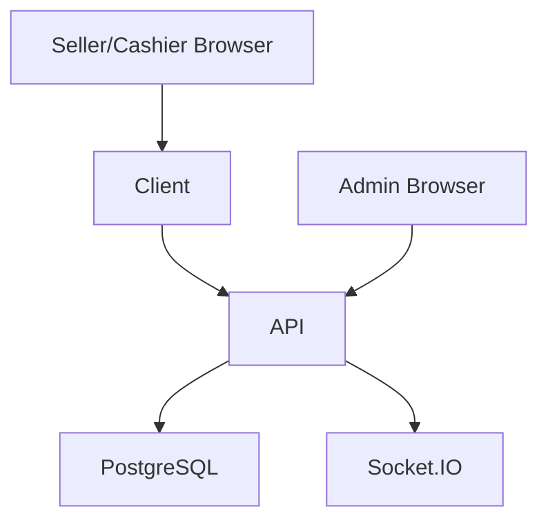

# Mona Jacinta — Demo V2

Mona Jacinta Demo V2 is an online multi-user, multi-branch clothing management system. It demonstrates the core commercial flow for branch operations: seller sale creation, cashier payment, transactional completion, inventory update, realtime refresh, and admin visibility.

## Architecture

- Client / POS: Next.js 16 + React 19
- Admin: Vite 7 + React 19
- API: Express 5 + TypeScript
- Database: PostgreSQL / Supabase + Prisma 7
- Realtime: Socket.IO



## Roles

- SELLER / Vendedor
- CASHIER / Cajero
- MANAGER / Gerente
- ADMIN / Administrador

## Quick Start

From the repository root:

1. Install dependencies if needed for `api/`, `client/`, `admin/`, and root scripts.
2. Configure `.env.development`.
   Reference: [`docs/development/database.md`](docs/development/database.md)
   Never include real database URLs or passwords in documentation or commits.
3. Reset the deterministic demo database:

```bash
npm run demo:reset
```

4. Start the API:

```bash
cd api
npm run dev
```

5. Start the Client:

```bash
cd client
npm run dev
```

6. Start the Admin:

```bash
cd admin
npm run dev
```

URLs:

- Client: <http://localhost:3000>
- Admin: <http://localhost:5173>

## Demo Accounts

DEMO ONLY. These are seed credentials for the presentation scenario, not infrastructure secrets.

- Seller: `seller01` / `demo123`
- Cashier: `cashier01` / `demo123`
- Admin: `admin` / `demo123`

Do not include database credentials in docs, screenshots, commits, or chat logs.

## Main Demo Flow

Seller:

- 2 x Remera Básica Negro/M
- 1 x Jean Slim Azul/42
- Total ARS 165.000
- Send to cashier

Cashier:

- Open cash session
- Transfer ARS 100.000
- Cash ARS 65.000
- Sale -> PAID
- Finalize -> COMPLETED

Admin:

- Verify completed sale
- Verify dashboard reflects the sale
- Verify inventory reflects decremented stock

Final Centro inventory:

- Remera Negro/M: 20 -> 18
- Jean Azul/42: 20 -> 19

Reference: [`docs/development/demo-e2e-verification.md`](docs/development/demo-e2e-verification.md)

## Documentation

- Getting started: [`docs/development/getting-started.md`](docs/development/getting-started.md)
- Database safety: [`docs/development/database.md`](docs/development/database.md)
- Demo reset: [`docs/development/demo-reset.md`](docs/development/demo-reset.md)
- API endpoints: [`docs/api/endpoints.md`](docs/api/endpoints.md)
- Testing strategy: [`docs/testing/strategy.md`](docs/testing/strategy.md)
- Architecture: [`docs/architecture/mona-demo-v2.md`](docs/architecture/mona-demo-v2.md)

## Demo V2 Out of Scope

- ARCA/CAE
- suppliers/purchasing
- warehouse transfers
- ecommerce storefront
- mobile app
- refunds/chargebacks
- full admin CRUD
- advanced reporting
