# 06-erd-data-model

**Status**: Production V1 Logical ERD Baseline  
**Scope**: Production V1 (Day 25–35)  
**Related**: 05-architecture, 07-inventory-ledger

---

## 1. Mermaid ER Diagram

```mermaid
erDiagram
    %% ==================== FOUNDATION ====================
    COMPANY ||--o{ LOCATION : has
    COMPANY ||--o{ USER : employs
    COMPANY ||--o{ DOCUMENT_COUNTER : sequences
    
    %% ==================== RBAC ====================
    USER }|--o{ USER_ROLE_SCOPE : has
    LOCATION }|--o{ USER_ROLE_SCOPE : assigns
    ROLE }|--o{ USER_ROLE_SCOPE : grants
    ROLE }|--o{ ROLE_PERMISSION : includes
    PERMISSION }|--o{ ROLE_PERMISSION : belongs_to
    
    %% ==================== CATALOG ====================
    COMPANY ||--o{ CATEGORY : defines
    COMPANY ||--o{ BRAND : defines
    CATEGORY ||--o{ PRODUCT : categorizes
    BRAND ||--o{ PRODUCT : brands
    PRODUCT ||--o{ PRODUCT_VARIANT : has
    PRODUCT ||--o{ PRODUCT_IMAGE : "has (0..1 primary)"
    PRODUCT_VARIANT }|--o{ INVENTORY_BALANCE : stocked_at
    
    %% ==================== PRICING ====================
    PRODUCT_VARIANT ||--o{ PRICE_HISTORY : tracks
    
    %% ==================== INVENTORY ====================
    LOCATION ||--o{ INVENTORY_BALANCE : holds
    PRODUCT_VARIANT ||--o{ INVENTORY_BALANCE : tracked_in
    INVENTORY_BALANCE ||--o{ STOCK_MOVEMENT : generates
    USER ||--o{ STOCK_MOVEMENT : performs
    LOCATION ||--o{ STOCK_MOVEMENT : at
    
    %% Logical holds (separate from physical - no balance columns)
    SALE ||--o{ STOCK_HOLD : reserves
    PRODUCT_VARIANT ||--o{ STOCK_HOLD : for
    LOCATION ||--o{ STOCK_HOLD : at
    
    COMMERCIAL_SENA ||--o{ SENA_ITEM : contains
    PRODUCT_VARIANT ||--o{ SENA_ITEM : reserves
    LOCATION ||--o{ SENA_ITEM : at
    COMMERCIAL_SENA ||--o{ SENA_PAYMENT : "has payments"
    COMMERCIAL_SENA ||--o{ SENA_SETTLEMENT : "fulfills to"
    
    %% External custody aggregates (authoritative, not balance columns)
    STOCK_TRANSFER ||--o{ TRANSFER_ITEM : includes
    TRANSFER_ITEM ||--o{ TRANSFER_RESOLUTION : resolves
    PUBLICATION_CHECKOUT ||--o{ PUBLICATION_ITEM : includes
    PUBLICATION_ITEM ||--o{ PUBLICATION_RETURN : resolved_by
    
    %% ==================== GOODS RECEIVING ====================
    SUPPLIER ||--o{ GOODS_RECEIPT : supplies
    LOCATION ||--o{ GOODS_RECEIPT : receives_at
    USER ||--o{ GOODS_RECEIPT : creates
    GOODS_RECEIPT ||--o{ GOODS_RECEIPT_ITEM : includes
    PRODUCT_VARIANT ||--o{ GOODS_RECEIPT_ITEM : for
    GOODS_RECEIPT ||--o{ GOODS_RECEIPT_ATTACHMENT : has
    
    %% Supplier-product relationship
    SUPPLIER }|--o{ SUPPLIED_PRODUCT : supplies
    PRODUCT_VARIANT }|--o{ SUPPLIED_PRODUCT : supplied_as
    
    %% ==================== TRANSFERS ====================
    LOCATION }|--o{ STOCK_TRANSFER : "origin"
    LOCATION }|--o{ STOCK_TRANSFER : "destination"
    USER ||--o{ STOCK_TRANSFER : requests
    STOCK_TRANSFER ||--o{ TRANSFER_ITEM : includes
    PRODUCT_VARIANT ||--o{ TRANSFER_ITEM : for
    STOCK_TRANSFER ||--o{ REMITO : generates
    
    %% ==================== POS / SALES ====================
    LOCATION ||--o{ SALE : at
    USER ||--o{ SALE : sells_as
    SALE ||--o{ SALE_ITEM : includes
    PRODUCT_VARIANT ||--o{ SALE_ITEM : sold_as
    PRODUCT ||--o{ SALE_ITEM : product_of
    SALE ||--o{ SALE_PAYMENT : paid_by
    SALE ||--o{ STOCK_HOLD : creates
    CASH_SESSION ||--o{ SALE_PAYMENT : "cash payments in"
    
    %% ==================== PAYMENTS ====================
    SALE_PAYMENT }|--o{ CASH_MOVEMENT : "cash creates"
    
    %% ==================== CASH ====================
    LOCATION ||--o{ CASH_REGISTER : has
    CASH_REGISTER ||--o{ CASH_SESSION : operates
    USER ||--o{ CASH_SESSION : "opens/closes"
    CASH_SESSION ||--o{ CASH_MOVEMENT : records
    USER ||--o{ CASH_MOVEMENT : performs
    
    %% ==================== EXCHANGES ====================
    SALE }|--o{ EXCHANGE : "original"
    SALE }|--o{ EXCHANGE : "replacement"
    LOCATION ||--o{ EXCHANGE : at
    EXCHANGE ||--o{ EXCHANGE_ITEM : includes
    PRODUCT_VARIANT ||--o{ EXCHANGE_ITEM : "returned/replacement"
    
    %% ==================== PUBLICATION ====================
    LOCATION ||--o{ PUBLICATION_CHECKOUT : from
    USER ||--o{ PUBLICATION_CHECKOUT : authorized_by
    PUBLICATION_CHECKOUT ||--o{ PUBLICATION_ITEM : includes
    PRODUCT_VARIANT ||--o{ PUBLICATION_ITEM : for
    PUBLICATION_ITEM ||--o{ PUBLICATION_RETURN : resolved_by
    
    %% ==================== DOCUMENTS / NUMBERING ====================
    DOCUMENT_COUNTER ||--o{ SALE : numbers
    DOCUMENT_COUNTER ||--o{ REMITO : numbers
    DOCUMENT_COUNTER ||--o{ GOODS_RECEIPT : numbers
    DOCUMENT_COUNTER ||--o{ COMMERCIAL_SENA : numbers
    DOCUMENT_COUNTER ||--o{ EXCHANGE : numbers
    
    %% ==================== NOTIFICATIONS / AUDIT ====================
    USER ||--o{ NOTIFICATION : receives
    LOCATION ||--o{ NOTIFICATION : scoped_to
    USER ||--o{ AUDIT_LOG : performs
    LOCATION ||--o{ AUDIT_LOG : at
    
    %% ==================== FISCAL ====================
    SALE }|--o{ FISCAL_OUTBOX : enqueues
    FISCAL_OUTBOX ||--o{ FISCAL_RESULT : produces
```



---

## 2. Entity Definitions

### 2.1 Foundation

#### COMPANY
| Aspect | Detail |
|--------|--------|
| **Purpose** | Root tenant entity (single company: Mona Jacinta) |
| **PK** | `id` (UUID) |
| **Important Fields** | `name`, `cuit`, `address`, `isActive`, `createdAt` |
| **FKs** | — |
| **Unique** | `cuit` |
| **Delete Policy** | Never deleted (single company) |
| **Mutability** | Immutable after creation |
| **Status** | **REUSED** (Demo V2 had implicit company) |

#### LOCATION
| Aspect | Detail |
|--------|--------|
| **Purpose** | Unified location: retail branch OR central warehouse |
| **PK** | `id` (UUID) |
| **Important Fields** | `name`, `code` (short, e.g., `CEN`), `type` (`RETAIL_BRANCH` \| `CENTRAL_WAREHOUSE`), `address`, `pointOfSaleNumber`, `isActive` |
| **FKs** | `companyId` |
| **Unique** | `code`, `pointOfSaleNumber` |
| **Indexes** | `type`, `isActive` |
| **Delete Policy** | Soft-delete (`isActive=false`) |
| **Mutability** | Mutable (name, address); `type` immutable after creation |
| **Status** | **ALTER** (Demo V2 `Branch` → add `type`) |

#### DOCUMENT_COUNTER
| Aspect | Detail |
|--------|--------|
| **Purpose** | Persistent sequential numbering per document type |
| **PK** | `id` (UUID) |
| **Important Fields** | `documentType` (`SALE` \| `REMITO` \| `GOODS_RECEIPT` \| `SENA` \| `EXCHANGE`), `locationId` (nullable, for branch-scoped), `prefix`, `nextValue` (BigInt), `padding` (default 6) |
| **FKs** | `locationId` → `Location` |
| **Unique** | `(documentType, locationId)` |
| **Delete Policy** | Never deleted |
| **Mutability** | `nextValue` incremented atomically |
| **Status** | **ALTER** (Demo V2 `SaleNumberCounter` → multi-type) |

---

### 2.2 RBAC

#### USER
| Aspect | Detail |
|--------|--------|
| **Purpose** | Employee/authenticated person |
| **PK** | `id` (UUID) |
| **Important Fields** | `name`, `email` (unique), `passwordHash`, `isActive`, `createdAt`, `updatedAt` |
| **FKs** | — |
| **Unique** | `email` |
| **Delete Policy** | Soft-delete (`isActive=false`) |
| **Mutability** | Mutable (name, password); email immutable |
| **Status** | **REUSED** |

#### ROLE
| Aspect | Detail |
|--------|--------|
| **Purpose** | Named role (SELLER, CASHIER, WAREHOUSE, ADMIN, OWNER) |
| **PK** | `id` (UUID) |
| **Important Fields** | `code` (unique), `name`, `description` |
| **FKs** | — |
| **Unique** | `code` |
| **Delete Policy** | Restricted (referenced) |
| **Mutability** | Immutable codes |
| **Status** | **REUSED** (codes changed: MANAGER→WAREHOUSE) |

#### PERMISSION
| Aspect | Detail |
|--------|--------|
| **Purpose** | Atomic permission constant |
| **PK** | `id` (UUID) |
| **Important Fields** | `code` (unique, e.g., `SALE_CREATE`), `description`, `category` |
| **FKs** | — |
| **Unique** | `code` |
| **Delete Policy** | Restricted |
| **Mutability** | Immutable codes |
| **Status** | **REUSED** |

#### ROLE_PERMISSION
| Aspect | Detail |
|--------|--------|
| **Purpose** | Many-to-many Role ↔ Permission |
| **PK** | `(roleId, permissionId)` |
| **FKs** | `roleId`, `permissionId` |
| **Delete Policy** | Cascade |
| **Status** | **REUSED** |

#### USER_ROLE_SCOPE
| Aspect | Detail |
|--------|--------|
| **Purpose** | User's role with location or company scope |
| **PK** | `id` (UUID) |
| **Important Fields** | `scopeKind` (`LOCATION` \| `COMPANY`), `locationId` (required when scopeKind=LOCATION; must be null when scopeKind=COMPANY) |
| **FKs** | `userId`, `roleId`, `locationId` |
| **Unique** | `(userId, roleId, scopeKind, locationId)` |
| **Indexes** | `locationId`, `roleId`, `scopeKind` |
| **Delete Policy** | Cascade |
| **Check Constraints** | `CHECK ( (scopeKind = 'LOCATION' AND locationId IS NOT NULL) OR (scopeKind = 'COMPANY' AND locationId IS NULL) )` |
| **Status** | **MIGRATE** (Demo V2 `UserBranchRole` → replace with scopeKind model) |

---

### 2.3 Catalog

#### CATEGORY
| Aspect | Detail |
|--------|--------|
| **Purpose** | Product category (company-scoped) |
| **PK** | `id` (UUID) |
| **Important Fields** | `name`, `companyId`, `isActive` |
| **FKs** | `companyId` |
| **Unique** | `(companyId, name)` |
| **Status** | **REUSED** |

#### BRAND
| Aspect | Detail |
|--------|--------|
| **Purpose** | Product brand (company-scoped) |
| **PK** | `id` (UUID) |
| **Important Fields** | `name`, `companyId`, `isActive` |
| **FKs** | `companyId` |
| **Unique** | `(companyId, name)` |
| **Status** | **REUSED** |

#### PRODUCT
| Aspect | Detail |
|--------|--------|
| **Purpose** | Sellable product concept (global) |
| **PK** | `id` (UUID) |
| **Important Fields** | `name`, `slug`, `description`, `categoryId`, `brandId`, `barcode` (Code 128, unique), `legacyCode` (optional), `isActive`, `primaryImageId` (nullable) |
| **FKs** | `categoryId`, `brandId`, `primaryImageId` → `ProductImage` |
| **Unique** | `slug`, `barcode` |
| **Indexes** | `categoryId`, `brandId`, `isActive` |
| **Delete Policy** | Soft-delete (`isActive=false`) |
| **Mutability** | `barcode` immutable after set; `isActive` toggled |
| **Status** | **ALTER** (add `barcode`, `legacyCode`, `primaryImageId`) |

#### PRODUCT_VARIANT
| Aspect | Detail |
|--------|--------|
| **Purpose** | Sellable variant (SKU, color, size) |
| **PK** | `id` (UUID) |
| **Important Fields** | `productId`, `sku` (unique), `color` (enum + OTHER), `size` (enum family), `listPrice`, `cashDiscount`, `cashDiscountType` (`PERCENT` \| `FIXED`), `wholesalePrice`, `cost`, `isActive` |
| **FKs** | `productId` |
| **Unique** | `sku` |
| **Indexes** | `productId`, `isActive` |
| **Delete Policy** | Soft-delete (`isActive=false`) |
| **Mutability** | Prices mutable (with PRICE_MANAGE); `sku` immutable |
| **Status** | **ALTER** (remove `barcode`, add pricing fields, `cost`) |

#### PRODUCT_IMAGE
| Aspect | Detail |
|--------|--------|
| **Purpose** | Primary product image metadata |
| **PK** | `id` (UUID) |
| **Important Fields** | `productId`, `storageKey`, `mimeType`, `sizeBytes`, `width`, `height`, `isPrimary`, `uploadedById`, `uploadedAt` |
| **FKs** | `productId`, `uploadedById` |
| **Unique** | `(productId, isPrimary)` partial where `isPrimary=true` |
| **Delete Policy** | Soft-delete (replacement marks old inactive) |
| **Status** | **NEW** |

#### PRICE_HISTORY
| Aspect | Detail |
|--------|--------|
| **Purpose** | Audit trail for price changes |
| **PK** | `id` (UUID) |
| **Important Fields** | `variantId`, `field` (`listPrice`\|`cashDiscount`\|`wholesalePrice`\|`cost`), `oldValue`, `newValue`, `changedById`, `reason`, `changedAt` |
| **FKs** | `variantId`, `changedById` |
| **Indexes** | `variantId`, `changedAt` |
| **Delete Policy** | Never deleted |
| **Status** | **NEW** |

---

### 2.4 Inventory

#### INVENTORY_BALANCE
| Aspect | Detail |
|--------|--------|
| **Purpose** | Current physical on-hand per variant × location |
| **PK** | `id` (UUID) |
| **Important Fields** | `variantId`, `locationId`, `onHand` (BigInt), `updatedAt` |
| **FKs** | `variantId`, `locationId` |
| **Unique** | `(variantId, locationId)` |
| **Indexes** | `locationId`, `variantId` |
| **Check Constraints** | `onHand >= 0` |
| **Delete Policy** | Never deleted (zero balance retained) |
| **Mutability** | Updated atomically with StockMovement (onHand only) |
| **Status** | **MIGRATE** (Demo V2 `Inventory`: rename `physical`→`onHand`, drop `reserved`) |

#### STOCK_MOVEMENT
| Aspect | Detail |
|--------|--------|
| **Purpose** | Immutable ledger of every PHYSICAL inventory change (Option A: unified ledger with balanceEffect) |
| **PK** | `id` (UUID) |
| **Important Fields** | `inventoryBalanceId`, `type` (see MovementType enum), `quantityDelta` (BigInt, signed), `balanceEffect` (`ON_HAND` \| `NONE`) — whether movement affects onHand, `beforeOnHand`, `afterOnHand`, `referenceType` (`SALE`\|`GOODS_RECEIPT`\|`TRANSFER_DISPATCH`\|`TRANSFER_RECEIVE`\|`TRANSFER_RETURN_TO_ORIGIN`\|`ADJUSTMENT`\|`DAMAGE_WRITE_OFF`\|`LOSS_WRITE_OFF`\|`PUBLICATION_CHECKOUT`\|`PUBLICATION_RETURN`\|`EXCHANGE_RETURN`\|`EXCHANGE_OUT`\|`INITIAL_STOCK`\|`INVENTORY_CORRECTION`), `referenceId`, `userId`, `locationId`, `notes`, `timestamp` |
| **FKs** | `inventoryBalanceId`, `userId`, `locationId` |
| **Indexes** | `(inventoryBalanceId, timestamp)`, `(referenceType, referenceId)`, `locationId`, `userId` |
| **Delete Policy** | **Never deleted** (immutable ledger) |
| **Mutability** | Immutable after insert |
| **Status** | **ALTER** (Demo V2: add snapshot fields, change types, add balanceEffect) |

##### StockMovementType Enum (with balanceEffect)

| Type | balanceEffect | Description |
|------|---------------|-------------|
| `SALE` | `ON_HAND` | Completed sale reduces onHand |
| `GOODS_RECEIPT` | `ON_HAND` | Receiving increases onHand |
| `TRANSFER_DISPATCH` | `ON_HAND` | Dispatch from origin reduces onHand |
| `TRANSFER_RECEIVE` | `ON_HAND` | Receive at destination increases onHand |
| `TRANSFER_RETURN_TO_ORIGIN` | `ON_HAND` | Return to origin increases onHand |
| `ADJUSTMENT` | `ON_HAND` | Manual correction ± onHand |
| `DAMAGE_WRITE_OFF` | contextual | Damage: in-store → ON_HAND (decreases onHand); publication/transfer → NONE (external custody already removed) |
| `LOSS_WRITE_OFF` | contextual | Loss: in-store → ON_HAND (decreases onHand); LOST_IN_TRANSIT/publication → NONE (external custody already removed) |
| `PUBLICATION_CHECKOUT` | `ON_HAND` | Checkout reduces onHand |
| `PUBLICATION_RETURN` | `ON_HAND` | Good return increases onHand |
| `EXCHANGE_RETURN` | `ON_HAND` | Exchange return increases onHand |
| `EXCHANGE_OUT` | `ON_HAND` | Exchange out reduces onHand |
| `INITIAL_STOCK` | `ON_HAND` | Initial import increases onHand |
| `INVENTORY_CORRECTION` | `ON_HAND` | Reconciliation correction ± onHand |

**Rule**: Only movements with `balanceEffect = ON_HAND` participate in the Location balance reconciliation invariant (`onHand ≡ Σ quantityDelta WHERE balanceEffect = ON_HAND`). `DAMAGE_WRITE_OFF` and `LOSS_WRITE_OFF` are contextual — they are `ON_HAND` when merchandise is still in a real Location (physical custody) and `NONE` when merchandise is already in external custody (transfer/publication). Movement type alone does not determine `balanceEffect`.

#### STOCK_HOLD (Technical POS Hold)
| Aspect | Detail |
|--------|--------|
| **Purpose** | Seller→cashier technical reservation (short-term) |
| **PK** | `id` (UUID) |
| **Important Fields** | `saleId`, `variantId`, `locationId`, `quantity`, `expiresAt`, `status` (`ACTIVE` \| `RELEASED` \| `CONSUMED`), `createdAt` |
| **FKs** | `saleId`, `variantId`, `locationId` |
| **Indexes** | `(saleId, status)`, `(variantId, locationId)`, `(status, expiresAt)` |
| **Delete Policy** | Never deleted (audit) |
| **Mutability** | `status` transitions only |
| **Status** | **ALTER** (Demo V2 `StockReservation` → rename) |

#### COMMERCIAL_SENA
| Aspect | Detail |
|--------|--------|
| **Purpose** | Customer reservation with deposit (24-hour) |
| **PK** | `id` (UUID) |
| **Important Fields** | `senaNumber` (from DocumentCounter), `locationId`, `customerId` (nullable), `customerName`, `customerPhone`, `customerEmail`, `status` (`ACTIVE` \| `EXPIRED` \| `FULFILLED` \| `CANCELLED`), `expiresAt`, `createdById`, `createdAt`, `resolvedAt`, `resolvedById` |
| **FKs** | `locationId`, `createdById`, `resolvedById` |
| **Unique** | `senaNumber` |
| **Indexes** | `locationId`, `status`, `expiresAt`, `customerId` |
| **Delete Policy** | Never deleted (historical) |
| **Status** | **NEW** |

#### SENA_ITEM
| Aspect | Detail |
|--------|--------|
| **Purpose** | Variant reserved in a SEÑA |
| **PK** | `id` (UUID) |
| **Important Fields** | `senaId`, `variantId`, `locationId`, `quantity`, `unitPriceSnapshot` |
| **FKs** | `senaId`, `variantId`, `locationId` |
| **Unique** | `(senaId, variantId, locationId)` |
| **Status** | **NEW** |

#### SENA_PAYMENT
| Aspect | Detail |
|--------|--------|
| **Purpose** | Financial record for SEÑA deposit |
| **PK** | `id` (UUID) |
| **Important Fields** | `senaId`, `method` (`CASH`\|`TRANSFER`\|`CARD_DEBIT`\|`CARD_CREDIT`), `amount`, `originInstitution` (for TRANSFER), `cashSessionId` (for CASH), `idempotencyKey`, `userId`, `timestamp` |
| **FKs** | `senaId`, `cashSessionId`, `userId` |
| **Unique** | `(senaId, idempotencyKey)` |
| **Indexes** | `senaId`, `userId`, `timestamp` |
| **Status** | **NEW** |

#### SENA_SETTLEMENT
| Aspect | Detail |
|--------|--------|
| **Purpose** | Atomic application of SEÑA deposit to a Sale; handoff from commercial hold to technical hold |
| **PK** | `id` (UUID) |
| **Important Fields** | `senaId`, `saleId`, `totalDepositApplied`, `balanceDue`, `createdById`, `createdAt` |
| **FKs** | `senaId` (unique), `saleId`, `createdById` |
| **Unique** | `senaId` (one settlement per SEÑA) |
| **Indexes** | `saleId`, `createdAt` |
| **Delete Policy** | Never deleted |
| **Status** | **NEW** |

---

### 2.5 Goods Receiving

#### SUPPLIER
| Aspect | Detail |
|--------|--------|
| **Purpose** | Supplier identity and contact |
| **PK** | `id` (UUID) |
| **Important Fields** | `name`, `cuit`, `contactName`, `phone`, `email`, `address`, `notes`, `isActive`, `createdAt` |
| **FKs** | — |
| **Unique** | `cuit` |
| **Delete Policy** | Soft-delete |
| **Status** | **NEW** (Day 25 operational) |

#### SUPPLIED_PRODUCT
| Aspect | Detail |
|--------|--------|
| **Purpose** | Supplier → ProductVariant mapping |
| **PK** | `id` (UUID) |
| **Important Fields** | `supplierId`, `variantId`, `supplierSku`, `supplierCost`, `leadTimeDays`, `isPreferred` |
| **FKs** | `supplierId`, `variantId` |
| **Unique** | `(supplierId, variantId)` |
| **Status** | **NEW** (Day 25) |

#### GOODS_RECEIPT
| Aspect | Detail |
|--------|--------|
| **Purpose** | Warehouse receiving document |
| **PK** | `id` (UUID) |
| **Important Fields** | `receiptNumber` (from DocumentCounter), `supplierId`, `locationId` (warehouse), `status` (`DRAFT` \| `IN_PROGRESS` \| `COMPLETED`), `expectedBultos`, `receivedBultos`, `requestedById`, `receivedById`, `completedById`, `completedAt`, `notes`, `createdAt`, `updatedAt` |
| **FKs** | `supplierId`, `locationId`, `requestedById`, `receivedById`, `completedById` |
| **Unique** | `receiptNumber` |
| **Indexes** | `supplierId`, `locationId`, `status`, `completedAt` |
| **Delete Policy** | Soft-delete (status-based); `COMPLETED` = immutable |
| **Status** | **NEW** (Day 25 MUST) |

#### GOODS_RECEIPT_ITEM
| Aspect | Detail |
|--------|--------|
| **Purpose** | Line item in receiving |
| **PK** | `id` (UUID) |
| **Important Fields** | `receiptId`, `variantId`, `quantity`, `unitCost`, `totalCost`, `receivedQuantity` (progressive) |
| **FKs** | `receiptId`, `variantId` |
| **Indexes** | `receiptId`, `variantId` |
| **Status** | **NEW** |

#### GOODS_RECEIPT_ATTACHMENT
| Aspect | Detail |
|--------|--------|
| **Purpose** | Photos/PDFs for receiving |
| **PK** | `id` (UUID) |
| **Important Fields** | `receiptId`, `storageKey`, `mimeType`, `sizeBytes`, `description`, `uploadedById`, `uploadedAt` |
| **FKs** | `receiptId`, `uploadedById` |
| **Status** | **NEW** |

---

### 2.6 Transfers

#### STOCK_TRANSFER
| Aspect | Detail |
|--------|--------|
| **Purpose** | Stock movement between locations |
| **PK** | `id` (UUID) |
| **Important Fields** | `originId`, `destinationId`, `status` (`REQUESTED` \| `APPROVED` \| `PREPARING` \| `DISPATCHED` \| `IN_TRANSIT` \| `RECEIVED` \| `RECEIVED_WITH_DIFFERENCE` \| `CANCELLED`), `requestedById`, `approvedById`, `dispatchedById`, `receivedById`, `requestedAt`, `approvedAt`, `dispatchedAt`, `receivedAt`, `observations` |
| **FKs** | `originId`, `destinationId`, `requestedById`, `approvedById`, `dispatchedById`, `receivedById` |
| **Indexes** | `originId`, `destinationId`, `status`, `requestedAt` |
| **Delete Policy** | Soft-delete via status |
| **Status** | **NEW** (Day 25 MUST) |

#### TRANSFER_ITEM
| Aspect | Detail |
|--------|--------|
| **Purpose** | Quantities tracked per variant |
| **PK** | `id` (UUID) |
| **Important Fields** | `transferId`, `variantId`, `requestedQty`, `approvedQty`, `dispatchedQty`, `receivedQty`, `returnedToOriginQty`, `lostInTransitQty` |
| **FKs** | `transferId`, `variantId` |
| **Unique** | `(transferId, variantId)` |
| **Indexes** | `transferId`, `variantId` |
| **Status** | **NEW** |

#### TRANSFER_RESOLUTION
| Aspect | Detail |
|--------|--------|
| **Purpose** | Explicit resolution of transfer discrepancies |
| **PK** | `id` (UUID) |
| **Important Fields** | `transferItemId`, `resolutionType` (`LATE_RECEIPT`\|`RETURNED_TO_ORIGIN`\|`LOST_IN_TRANSIT`), `quantity`, `resolvedById`, `resolvedAt`, `notes` |
| **FKs** | `transferItemId`, `resolvedById` |
| **Indexes** | `transferItemId` |
| **Status** | **NEW** |

#### REMITO
| Aspect | Detail |
|--------|--------|
| **Purpose** | Delivery note for transfer dispatch |
| **PK** | `id` (UUID) |
| **Important Fields** | `remitoNumber` (from DocumentCounter), `transferId`, `originId`, `destinationId`, `dispatchedById`, `dispatchedAt`, `itemsJson` (snapshot) |
| **FKs** | `transferId`, `originId`, `destinationId`, `dispatchedById` |
| **Unique** | `remitoNumber` |
| **Status** | **NEW** (Day 25 MUST) |

---

### 2.7 POS / Sales

#### SALE
| Aspect | Detail |
|--------|--------|
| **Purpose** | Commercial sale transaction |
| **PK** | `id` (UUID) |
| **Important Fields** | `saleNumber`, `locationId`, `sellerId`, `customerCode` (`01`\|`02`), `status` (`DRAFT`\|`PENDING_PAYMENT`\|`PAID`\|`COMPLETED`\|`CANCELLED`), `subtotal`, `discountTotal`, `total`, `createdAt`, `updatedAt`, `completedAt` |
| **FKs** | `locationId`, `sellerId` |
| **Unique** | `(locationId, saleNumber)` |
| **Indexes** | `(locationId, status, createdAt)`, `(sellerId, status, createdAt)`, `status` |
| **Delete Policy** | Never deleted (status = CANCELLED/COMPLETED) |
| **Status** | **KEEP** (extend: add `customerCode`, ensure snapshots) |

#### SALE_ITEM
| Aspect | Detail |
|--------|--------|
| **Purpose** | Immutable line item with price snapshot |
| **PK** | `id` (UUID) |
| **Important Fields** | `saleId`, `variantId`, `productId`, `productName`, `variantName`, `sku`, `quantity`, `unitPrice`, `subtotal`, `priceType` (`LIST`\|`CASH`\|`WHOLESALE`) |
| **FKs** | `saleId`, `variantId`, `productId` |
| **Indexes** | `saleId`, `variantId`, `productId` |
| **Delete Policy** | Never deleted |
| **Mutability** | Immutable after creation |
| **Status** | **KEEP** (already has snapshots) |

#### SALE_PAYMENT
| Aspect | Detail |
|--------|--------|
| **Purpose** | Payment for a sale (split payments supported) |
| **PK** | `id` (UUID) |
| **Important Fields** | `saleId`, `method` (`CASH`\|`TRANSFER`\|`CARD_DEBIT`\|`CARD_CREDIT`\|`QR`), `amount`, `receivedAmount`, `changeAmount`, `originInstitution` (for TRANSFER), `installments` (for CARD_CREDIT), `cardBrand`, `idempotencyKey`, `paidAt`, `cashSessionId` |
| **FKs** | `saleId`, `cashSessionId` |
| **Unique** | `(saleId, idempotencyKey)` |
| **Indexes** | `saleId`, `cashSessionId`, `paidAt` |
| **Delete Policy** | Never deleted |
| **Status** | **ALTER** (add `originInstitution`, `installments`, `cardBrand`) |

---

### 2.8 Cash

#### CASH_REGISTER
| Aspect | Detail |
|--------|--------|
| **Purpose** | Physical register at a location |
| **PK** | `id` (UUID) |
| **Important Fields** | `locationId`, `name`, `isActive` |
| **FKs** | `locationId` |
| **Unique** | `(locationId, name)` |
| **Status** | **REUSED** |

#### CASH_SESSION
| Aspect | Detail |
|--------|--------|
| **Purpose** | Cash drawer session |
| **PK** | `id` (UUID) |
| **Important Fields** | `registerId`, `openedById`, `openedAt`, `closedById`, `closedAt`, `startingCash`, `expectedCash`, `countedCash`, `difference`, `status` (`OPEN`\|`CLOSED`) |
| **FKs** | `registerId`, `openedById`, `closedById` |
| **Indexes** | `(registerId, status)`, `openedById`, `closedById` |
| **Partial Unique Index** | `registerId` WHERE `status = 'OPEN'` |
| **Delete Policy** | Never deleted |
| **Status** | **REUSED** |

#### CASH_MOVEMENT
| Aspect | Detail |
|--------|--------|
| **Purpose** | Append-only cash movement |
| **PK** | `id` (UUID) |
| **Important Fields** | `sessionId`, `type` (`OPENING`\|`SALE_INCOME`\|`CLOSING`\|`MANUAL`\|`DEPOSIT`\|`WITHDRAWAL`\|`ADJUSTMENT`), `amount`, `salePaymentId` (nullable, unique), `userId`, `notes`, `timestamp` |
| **FKs** | `sessionId`, `salePaymentId`, `userId` |
| **Unique** | `salePaymentId` (nullable, for SALE_INCOME) |
| **Indexes** | `(sessionId, timestamp)`, `userId` |
| **Delete Policy** | Never deleted |
| **Status** | **ALTER** (add `DEPOSIT`, `WITHDRAWAL`, `ADJUSTMENT` types) |

---

### 2.9 Exchanges

#### EXCHANGE
| Aspect | Detail |
|--------|--------|
| **Purpose** | Cross-branch exchange linking original + replacement sale |
| **PK** | `id` (UUID) |
| **Important Fields** | `exchangeNumber` (from DocumentCounter), `originalSaleId`, `replacementSaleId`, `locationId` (where exchange occurs), `reason`, `priceDifference`, `priceDifferencePaymentId`, `createdById`, `createdAt` |
| **FKs** | `originalSaleId`, `replacementSaleId`, `locationId`, `createdById`, `priceDifferencePaymentId` |
| **Unique** | `exchangeNumber` |
| **Indexes** | `originalSaleId`, `replacementSaleId`, `locationId` |
| **Status** | **NEW** (Day 25 MUST) |

#### EXCHANGE_ITEM
| Aspect | Detail |
|--------|--------|
| **Purpose** | Returned and replacement items |
| **PK** | `id` (UUID) |
| **Important Fields** | `exchangeId`, `variantId`, `type` (`RETURNED` \| `REPLACEMENT`), `quantity`, `unitPrice` |
| **FKs** | `exchangeId`, `variantId` |
| **Status** | **NEW** |

---

### 2.10 Publication / Photo Merchandise

#### PUBLICATION_CHECKOUT
| Aspect | Detail |
|--------|--------|
| **Purpose** | Merchandise checked out for publication |
| **PK** | `id` (UUID) |
| **Important Fields** | `locationId`, `person` (name), `authorizedById`, `purpose`, `notes`, `mediaKeys` (JSON array), `status` (`OUT` \| `RETURNED` \| `PARTIAL`), `checkedOutAt`, `expectedReturnAt` |
| **FKs** | `locationId`, `authorizedById` |
| **Indexes** | `locationId`, `status`, `checkedOutAt` |
| **Status** | **NEW** (Day 25 MUST) |

#### PUBLICATION_ITEM
| Aspect | Detail |
|--------|--------|
| **Purpose** | Variant checked out |
| **PK** | `id` (UUID) |
| **Important Fields** | `checkoutId`, `variantId`, `quantity`, `status` (`OUT` \| `RETURNED_GOOD` \| `RETURNED_DAMAGED` \| `LOST`) |
| **FKs** | `checkoutId`, `variantId` |
| **Unique** | `(checkoutId, variantId)` |
| **Status** | **NEW** |

#### PUBLICATION_RETURN
| Aspect | Detail |
|--------|--------|
| **Purpose** | Resolution of checked-out item |
| **PK** | `id` (UUID) |
| **Important Fields** | `itemId`, `condition` (`GOOD` \| `DAMAGED` \| `LOSS`), `receivedById`, `receivedAt`, `notes`, `damagePhotosKeys` |
| **FKs** | `itemId`, `receivedById` |
| **Status** | **NEW** |

---

### 2.11 Notifications / Audit

#### NOTIFICATION
| Aspect | Detail |
|--------|--------|
| **Purpose** | Persisted notification (DB = source of truth) |
| **PK** | `id` (UUID) |
| **Important Fields** | `userId`, `locationId`, `priority` (`HIGH` \| `LOW`), `type` (`STOCK_ADJUSTMENT`\|`WRITE_OFF`\|`TRANSFER_DISCREPANCY`\|`GOODS_RECEIPT`\|`LOW_STOCK`\|`PRICE_CHANGE`\|`SENA_EXPIRY`\|`LARGE_SALE`\|`SALE_PENDING`\|`SALE_COMPLETED`), `title`, `message`, `referenceType`, `referenceId`, `readAt`, `createdAt` |
| **FKs** | `userId`, `locationId` |
| **Indexes** | `(userId, readAt)`, `(locationId, priority, createdAt)`, `(referenceType, referenceId)` |
| **Status** | **NEW** (replaces Socket.IO-only events) |

#### AUDIT_LOG
| Aspect | Detail |
|--------|--------|
| **Purpose** | Immutable audit trail |
| **PK** | `id` (UUID) |
| **Important Fields** | `userId`, `locationId`, `action`, `entityType`, `entityId`, `before` (JSON), `after` (JSON), `timestamp` |
| **FKs** | `userId`, `locationId` |
| **Indexes** | `(locationId, timestamp)`, `(entityType, entityId, timestamp)`, `(userId, timestamp)` |
| **Delete Policy** | Never deleted |
| **Status** | **KEEP** (extend entityType coverage) |

---

### 2.12 Fiscal / ARCA

#### FISCAL_OUTBOX
| Aspect | Detail |
|--------|--------|
| **Purpose** | Reliable fiscal document queue |
| **PK** | `id` (UUID) |
| **Important Fields** | `saleId`, `documentType` (`INVOICE_A`\|`INVOICE_B`\|`TICKET`\|`CREDIT_NOTE`), `payload` (JSON), `status` (`PENDING`\|`PROCESSING`\|`COMPLETED`\|`FAILED`), `attempts`, `lastError`, `createdAt`, `processedAt` |
| **FKs** | `saleId` |
| **Indexes** | `saleId`, `status`, `createdAt` |
| **Status** | **NEW** |

#### FISCAL_RESULT
| Aspect | Detail |
|--------|--------|
| **Purpose** | ARCA response storage |
| **PK** | `id` (UUID) |
| **Important Fields** | `outboxId`, `cae`, `caeExpiration`, `voucherNumber`, `pointOfSaleNumber`, `resultJson`, `processedAt` |
| **FKs** | `outboxId` |
| **Unique** | `outboxId` |
| **Status** | **NEW** |

---

## 3. Status Summary

| Entity | Status |
|--------|--------|
| Company | REUSED |
| Location | ALTER (Branch + type) |
| DocumentCounter | ALTER (SaleNumberCounter → multi) |
| User | REUSED |
| Role | REUSED (codes updated) |
| Permission | REUSED |
| RolePermission | REUSED |
| UserRoleScope | MIGRATE (UserBranchRole → scopeKind) |
| Category | REUSED |
| Brand | REUSED |
| Product | ALTER (+barcode, +legacyCode, +primaryImageId) |
| ProductVariant | ALTER (-barcode, +pricing fields, +cost) |
| ProductImage | NEW |
| PriceHistory | NEW |
| InventoryBalance | MIGRATE (Inventory → onHand only) |
| StockMovement | ALTER (+snapshots, new types) |
| StockHold | ALTER (StockReservation renamed) |
| CommercialSena | NEW |
| SenaItem | NEW |
| SenaPayment | NEW |
| SenaSettlement | NEW |
| Supplier | NEW |
| SuppliedProduct | NEW |
| GoodsReceipt | NEW |
| GoodsReceiptItem | NEW |
| GoodsReceiptAttachment | NEW |
| StockTransfer | NEW |
| TransferItem | NEW |
| TransferResolution | NEW |
| Remito | NEW |
| Sale | KEEP (extend) |
| SaleItem | KEEP |
| SalePayment | ALTER (+transfer metadata) |
| CashRegister | REUSED |
| CashSession | REUSED |
| CashMovement | ALTER (+types) |
| Exchange | NEW |
| ExchangeItem | NEW |
| PublicationCheckout | NEW |
| PublicationItem | NEW |
| PublicationReturn | NEW |
| Notification | NEW |
| AuditLog | KEEP (extend) |
| FiscalOutbox | NEW |
| FiscalResult | NEW |

**Total: 45 entities**
---

## 4. Key Indexes for Performance

```sql
-- Inventory fast lookups
CREATE INDEX idx_inventory_balance_location_variant ON inventory_balance(location_id, variant_id);
CREATE INDEX idx_inventory_balance_variant ON inventory_balance(variant_id);

-- StockMovement audit queries
CREATE INDEX idx_stock_movement_balance_time ON stock_movement(inventory_balance_id, timestamp);
CREATE INDEX idx_stock_movement_ref ON stock_movement(reference_type, reference_id);
CREATE INDEX idx_stock_movement_location_time ON stock_movement(location_id, timestamp);

-- Sale queries
CREATE INDEX idx_sale_location_status_time ON sale(location_id, status, created_at);
CREATE INDEX idx_sale_seller_status_time ON sale(seller_id, status, created_at);

-- Transfer queries
CREATE INDEX idx_transfer_origin_status ON stock_transfer(origin_id, status);
CREATE INDEX idx_transfer_dest_status ON stock_transfer(destination_id, status);

-- Notification delivery
CREATE INDEX idx_notification_user_unread ON notification(user_id, read_at) WHERE read_at IS NULL;
CREATE INDEX idx_notification_location_priority ON notification(location_id, priority, created_at);

-- Hold expiry scanning
CREATE INDEX idx_stock_hold_expiry ON stock_hold(status, expires_at) WHERE status = 'ACTIVE';
CREATE INDEX idx_sena_expiry ON commercial_sena(status, expires_at) WHERE status = 'ACTIVE';
```

---

## 5. Check Constraints Summary

```sql
-- InventoryBalance invariants
ALTER TABLE inventory_balance ADD CONSTRAINT chk_onhand_nonneg CHECK (on_hand >= 0);

-- CashSession one-open-per-register
CREATE UNIQUE INDEX uq_cash_session_one_open 
  ON cash_session(register_id) 
  WHERE status = 'OPEN';

-- DocumentCounter uniqueness
CREATE UNIQUE INDEX uq_document_counter_type_location 
  ON document_counter(document_type, location_id);

-- ProductImage single primary per product
CREATE UNIQUE INDEX uq_product_image_primary 
  ON product_image(product_id) 
  WHERE is_primary = true;

-- UserRoleScope scope/location consistency
ALTER TABLE user_role_scope 
  ADD CONSTRAINT chk_user_role_scope_consistency 
  CHECK ( (scope_kind = 'LOCATION' AND location_id IS NOT NULL) 
       OR (scope_kind = 'COMPANY' AND location_id IS NULL) );
```

---

*End of 06-erd-data-model.md*